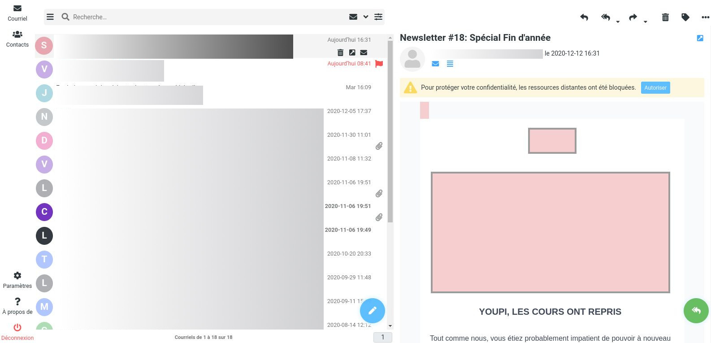
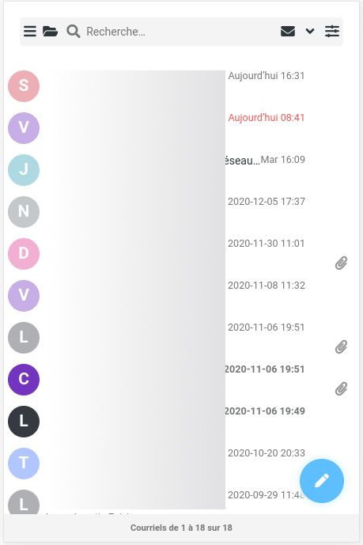

# rc-minimalist

rc-minimalist is a minimalist skin for roundcubemail

## installation

clone repository in your skin directory

    cd <your-directory-roundcubemail>/skins
    git clone https://github.com/fraoustin/rc-minimalist.git

## use Docker

you can generate a specific image with rc-minimalist skin

    git clone https://github.com/fraoustin/rc-minimalist.git
    cd rc-minimalist
    docker build -t test .

And after, you can run test image with gmail parameter (for sample)

    docker run -e ROUNDCUBEMAIL_DEFAULT_HOST=ssl://imap.gmail.com -e ROUNDCUBEMAIL_DEFAULT_PORT=993 -e ROUNDCUBEMAIL_SMTP_SERVER=tls://smtp.gmail.com -e ROUNDCUBEMAIL_SMTP_PORT=587 -e ROUNDCUBEMAIL_SKIN=rc-minimalist -p 80:80 -d test

and you could access on http://127.0.0.1